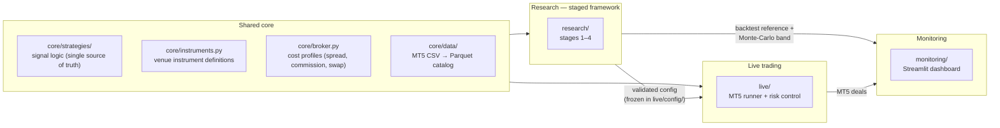
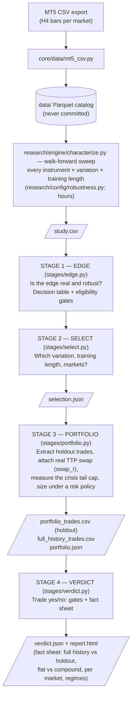
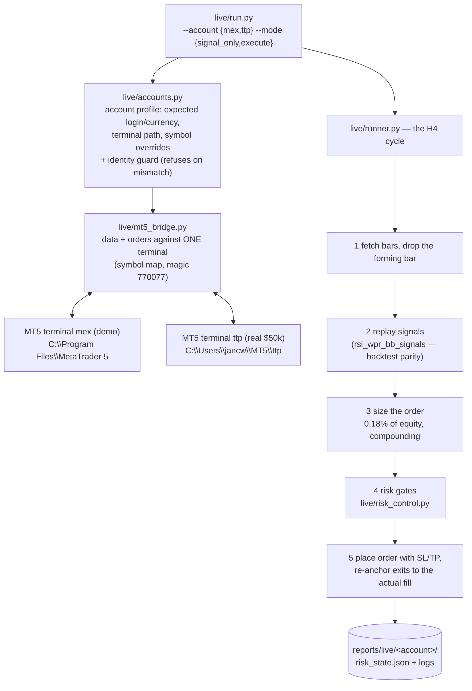
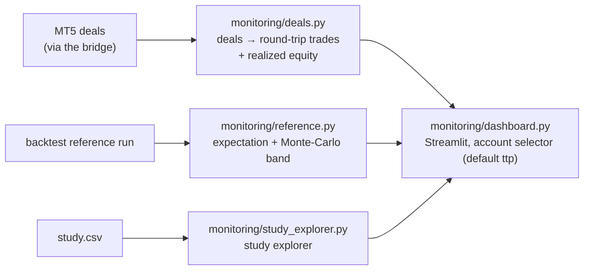
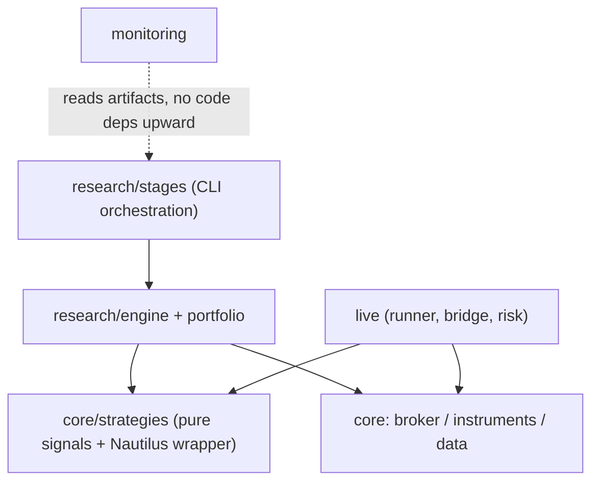

# Architecture

The map of the system: what exists, how the pieces nest, and where the data flows.
Read this before diving into any module — every file below links back to a one-line
purpose, and the diagrams show the paths a bar of market data can take.

> Snapshot after the 3-worlds restructure (2026-07-17).
> If structure changes, change this file in the same PR.

---

## 1. The three worlds

The repo is four flat packages — `core`, `research`, `live`, `monitoring` — one
shared core plus the three worlds. Truth flows left to right: research validates a configuration,
the frozen config goes live, and monitoring compares live results back against the
research expectation.



| World | Entry point | Output |
|---|---|---|
| Research | `uv run python -m research.stages.<stage>` | `reports/research/run_*/` |
| Live | `uv run python -m live.run --account {mex,ttp} --mode {signal_only,execute}` | orders on MT5 + `reports/live/<account>/` |
| Monitoring | `uv run streamlit run monitoring/dashboard.py` | browser dashboard |

---

## 2. Research pipeline — the staged framework

One *research run* is a directory under `reports/research/run_*/`. Each stage
reads the previous stage's artifact from it and writes its own; every stage prints
the exact next command. Methodology behind it: [methodology.md](methodology.md).



Cost model in research (matches the live TTP account):

- **In-engine** (during every backtest): spread, commission, slippage from the
  broker profile — `broker.standard_broker()` = TTP Markets.
- **After extraction**: overnight **swap** from the pulled snapshot
  (`core/config/broker/ttp_markets_swaps.json`) as a separate `swap_r` column per trade.
  `r` stays gross; swap is booked as a **realized** cost at close and never
  marked to market (see `portfolio/curves.py` — this split keeps the
  mark-to-market drawdown stable).
- The **study sweep is deliberately swap-free**: swap is near-uniform across
  variations, so it cannot change the selection — the money-true numbers come
  from stages 3–4.

### How a backtest actually executes (the nesting)

The call stack from a stage down to the strategy — this is where things are
"nested inside each other":

```text
research/stages/portfolio.py             orchestrates the stage
└─ portfolio/trades.make_extract_fn()    builds the per-market extractor
   └─ portfolio/trades.extract_market_trades  extracts the timed OOS trade stream
      ├─ SELECTION (per window, train data only)
      │  └─ engine/walkforward.py        splits history into train/test windows
      │     └─ engine/grid.py            runs the parameter sweep on each train window
      └─ EXECUTION (once, across the whole out-of-sample span)
         └─ engine/schedule_builder.py   windows + chosen params -> a parameter schedule
            └─ engine/continuous.py      ONE engine run; positions carry across seams
               └─ engine/recipe.py       builds the NautilusTrader run config
                  └─ NautilusTrader BacktestEngine
                     └─ core/strategies/rsi_wpr_bb.py        (thin Nautilus wrapper;
                                                          obeys the schedule)
                        └─ core/strategies/rsi_wpr_bb_signals.py  (pure signal engine —
                                                          the SAME code live uses)
```

Everything above `trades.py` returns plain DataFrames; the portfolio math modules
(`curves`, `sizing`, `risk`, `tail`, `stress`, `factsheet`) are pure functions on
those frames — no engine, fully unit-tested.

---

## 3. Live path

One process per account, one MT5 terminal per process. The same pure signal engine
as the backtest, driven one closed H4 bar at a time.



- **Risk limits** (`risk_control.py`, deliberately *stricter* than the prop rules):
  daily stop 2.5% (TTP hard limit 3%), trailing max drawdown 5% (TTP 6%),
  combined open-risk cap 2.0%.
- **`live/preflight.py`** — GO/NO-GO before going live: identity, algo trading
  enabled, all symbols resolve and are sizable.
- **`live/parity_check.py`** — does the broker feed produce the same signals as
  our research data?
- **Frozen config**: `live/config/rsi_wpr_bb.py` (10 markets, per-market
  SL/TP). Promotion to live == adding a config here, never new code.

---

## 4. Monitoring



The question the dashboard answers: **is live behaving like the backtest said it
would** — or drifting outside the Monte-Carlo band?

---

## 5. Module map

One line per file. If a docstring and this table disagree, one of them is a bug.

### Shared core

| File | Purpose |
|---|---|
| `core/strategies/rsi_wpr_bb_signals.py` | Pure signal engine for RsiWprBb — single source of truth shared by backtest and live |
| `core/strategies/param_schedule.py` | Time-keyed parameter schedule: which parameters govern new entries, and when |
| `core/strategies/rsi_wpr_bb.py` | Thin NautilusTrader wrapper around the signal engine (backtest execution) |
| `core/instruments.py` | Instrument definitions for the venues we trade |
| `core/broker.py` | Swappable broker/market cost profiles; `standard_broker()` = TTP + real swap snapshot |
| `core/paths.py` | Repo-root resolution (walks up to `pyproject.toml`) — used everywhere for stable paths |
| `core/data/mt5_csv.py` | Import MT5 CSV exports into the Parquet catalog |

### Research — engine (backtest + walk-forward machinery)

| File | Purpose |
|---|---|
| `research/engine/config.py` | Run one NautilusTrader backtest + extract its per-trade PnLs; load config modules |
| `research/engine/recipe.py` | Factory for per-instrument sweep recipes (one engine run) |
| `research/engine/grid.py` | Parameter sweep across combinations |
| `research/engine/montecarlo.py` | Monte-Carlo robustness from per-trade PnLs (profit probability, drawdown) |
| `research/engine/overfitting.py` | Selection-bias statistics: deflated Sharpe, PBO, the multiple-testing budget |
| `research/regression.py` | Compares a candidate run against a reference against stated expectations |
| `research/forward_test_registry.py` | Immutable content-hashed forward cohorts + append-only daily net-R observations |
| `research/engine/continuous.py` | Executes the out-of-sample span as ONE run under a schedule |
| `research/engine/schedule_builder.py` | Turns windows + their selected parameters into that schedule |
| `research/engine/walkforward.py` | Walk-forward window scheme (train/test splits, purge/embargo) |
| `research/engine/walkforward_runner.py` | Walk-forward runner (drives backtests over the windows) |
| `research/engine/characterize.py` | The robustness study: walk-forward every instrument × variation, in parallel |

### Research — portfolio math (pure, on DataFrames)

| File | Purpose |
|---|---|
| `research/portfolio/trades.py` | The timestamped OOS trade stream + the stage-3 extractor factory |
| `research/portfolio/stats.py` | Shared metric helpers: edge/risk stats, R-multiples, daily equity |
| `research/portfolio/curves.py` | Daily realized + mark-to-market equity curves (swap realized-only) |
| `research/portfolio/sizing.py` | Position-sizing simulation: per-trade risk + the daily path |
| `research/portfolio/risk.py` | The risk system: account context + pluggable tail-capped sizing policies |
| `research/portfolio/tail.py` | The crisis tail on the FULL history — the ceiling no policy may cross |
| `research/portfolio/stress.py` | Does the sized account survive a worse-than-history gap? |
| `research/portfolio/drawdown.py` | Prop-firm drawdown rule (trailing/hybrid) |
| `research/portfolio/factsheet.py` | End-of-run metrics matrix (full vs holdout, flat vs compound, net of swap) |
| `research/portfolio/html_report.py` | Self-contained `report.html` from a fact sheet |
| `research/portfolio/regime.py` | Does the edge hold across volatility/trend regimes? |
| `research/portfolio/swap_analysis.py` | Swap-cost report + snapshot refresh (`pull_swap_specs`) |

### Research — stages (the CLI)

| File | Purpose |
|---|---|
| `research/stages/_runbook.py` | Run directory + terminal UX (banner, next command) |
| `research/stages/lineage.py` | Content-addressed lineage: stage manifests, atomic publication, the read gate |
| `research/stages/open_report.py` | Opens a run's report only while its lineage still verifies |
| `research/stages/edge.py` | Stage 1 — is the edge real, where, is it robust? |
| `research/stages/select.py` | Stage 2 — which structure and which markets? |
| `research/stages/universe.py` | Stage-2 selection logic (structure + market universe) |
| `research/stages/portfolio.py` | Stage 3 — combine + size under a risk policy |
| `research/stages/verdict.py` | Stage 4 — trade yes/no + fact sheet + report |

### Live

| File | Purpose |
|---|---|
| `live/run.py` | Entry point: CLI, logging, account wiring, main loop |
| `live/accounts.py` | Account profiles (mex/ttp) + identity guard |
| `live/mt5_bridge.py` | Data + orders against a running MT5 terminal |
| `live/runner.py` | The H4 cycle: bars → signals → sizing → risk gates → orders |
| `live/risk_control.py` | Prop-firm limits: daily stop, trailing drawdown, open-risk cap |
| `live/preflight.py` | GO/NO-GO checks before going live |
| `live/parity_check.py` | Live feed vs research data: same signals? |
| `live/notify.py` | Signal notifications (optional Telegram) |

### Monitoring

| File | Purpose |
|---|---|
| `monitoring/dashboard.py` | Streamlit dashboard (account-aware, default ttp) |
| `monitoring/deals.py` | MT5 deals → round-trip trades + cashflows + realized equity + stats |
| `monitoring/risk_view.py` | What the dashboard may claim: open-risk determinacy + the window's risk basis |
| `monitoring/reference.py` | Backtest reference + Monte-Carlo expectation band |
| `monitoring/study_explorer.py` | Study explorer: slice + aggregate study results |

### Engineering quality tooling

| File | Purpose |
|---|---|
| `scripts/quality/classify.py` | Applies the authoritative TOML risk model to changed paths |
| `scripts/quality/validate_task.py` | Validates task sections, AC/INV test traceability, and review dispositions |
| `scripts/quality/impact.py` | Recommends focused tests from static dependencies plus explicit critical edges |
| `scripts/quality/pr_ready.py` | Composes risk, task, review, traceability, and evidence-freshness gates |
| `scripts/quality/mutation.py` | Runs focused Linux mutation scopes and enforces the TOML survivor ratchet |
| `scripts/quality/security.py` | Scans tracked files for redacted secret findings under the TOML security policy |
| `scripts/quality/pr_body.py` | Binds required PR sections to one current, ready task artifact |
| `scripts/quality/hooks/decisions.py` | Pure block/allow policy for Claude Code Bash boundaries |
| `scripts/quality/hooks/pre_bash.py` | Collects Git/task metadata and emits Claude Code hook responses |

Test design matrices, reusable semantic assertions, deterministic property strategies, and the
Windows/Linux mutation split are specified in `docs/engineering/testing.md`.
Claude Code skill, reviewer-agent, settings, and hook schemas are specified in
`docs/engineering/claude-code.md`.

---

## 6. Dependency rules

The import direction is strictly downward; nothing imports from `stages/`.



- `core/strategies/rsi_wpr_bb_signals.py` is **pure** (no Nautilus, no MT5) — that is
  what makes backtest/live parity possible. Only the thin wrapper touches Nautilus;
  only the bridge touches MT5.
- The portfolio math never talks to an engine — stages pass it DataFrames.
- The import direction has exactly **two** allowlisted crossings, both architecture debt tracked
  for removal and frozen by `tests/test_import_boundaries.py`:
  - `live/` imports from `research/` only the generic `load_config_module` helper (a by-path module
    loader) to read its own config; it never touches the research engine or portfolio math.
  - `research/portfolio/swap_analysis.py` imports `live.accounts` / `live.mt5_bridge` to refresh the
    broker swap snapshot from the live MT5 bridge (cleanup tracked in issue #61).

---

## 7. Directories & artifacts

| Path | Contents | Versioned? |
|---|---|---|
| `data/` | Parquet catalog + raw CSV exports | no |
| `reports/research/run_*/` | one research run: study.csv, selection.json, trades, verdict, report.html | no |
| `reports/live/<account>/` | per-account live state: risk_state.json, logs | no |
| `research/config/` | study definition: variations, grid, instruments, account | yes |
| `live/config/` | frozen live configs (promotion == adding one) | yes |
| `core/config/broker/` | pulled swap snapshots per broker | yes |
| `docs/` | methodology (the spec), runbook, this file | yes |
| `.ai/quality/` | TOML risk, finding, task-schema, critical-dependency, and mutation models | yes |
| `.ai/tasks/` | concise task specifications, test traceability, review, and evidence | yes |
| `.ai/impact/test-map.json` | local conservative changed-file test-impact recommendation | no |
| `.claude/skills/` | Claude Code workflow procedures with trigger frontmatter | yes |
| `.claude/agents/` | least-privilege read-only reviewer subagents | yes |
| `.claude/settings.json` | thin project hook event wiring | yes |

## 8. Conventions that keep the numbers honest

- **R multiples everywhere**: a trade's result is measured in units of its own
  planned risk — scale- and sizing-invariant. Money enters only at the sizing step.
- **`r` is gross; `swap_r` is separate** and realized at close — never marked to
  market. Netting them would corrupt the floating-PnL interpolation.
- **Flat vs compound** are two lenses on the same trades; only annual return and
  max drawdown differ between them, and the fact sheet shows both side by side.
- **The holdout is sacred**: reserved months no stage selected on; stage 3 extracts
  it once, stage 4 judges on it.
- **Live mirrors research**: same signal code, same 0.18% risk, same TTP cost
  reality (engine costs + pulled swap snapshot), stricter internal limits than the
  prop firm's.
